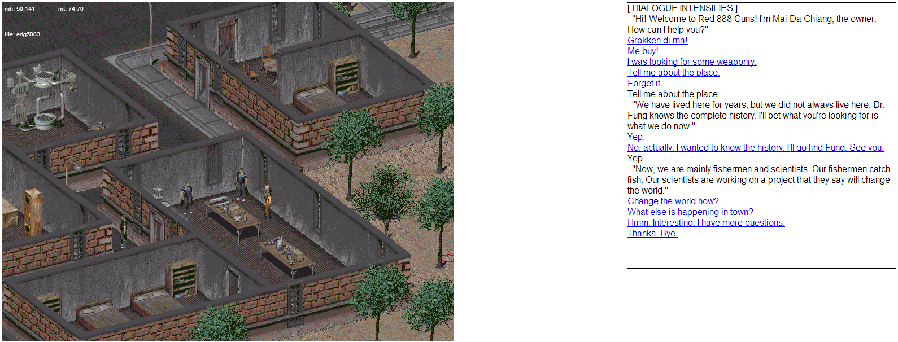

This is the continuation of my DarkFO dev blog (previous entry [here](darkfo_devlog_pt_1.html)), where I will recall and ruminate upon my experience on today's development effort.

Today I mainly focused on the scripting engine. It was my focus yesterday, and should be the main focus until it's somewhere around finished enough to support basic map/critter scripting functionality.

I Learned Things
----------------

After hoisting my test scripting engine into a new `play` mode, and then cleaning it up a bit, I stubbed a few more functions.
By this time, I realize that I will need to start adding in the meat of the game logic. To do that, I needed to *learn things*.

The *Fallout 2* scripting language does not support objects or records, but it *does* support pointers (which are just an integral type. I am not entirely sure if the language has actual types -- by far the most used types of values are integers, strings only coming in with debug or display messages, where it's shown that the `+` operator is overloaded to concatenate strings and coerce integers to strings as well.)

Objects (such as critters (a generic term for actors in the world; strangely enough includes refrigerators)) are referred to by pointers. The most common object reference is, of course, the player object, called `obj_dude` in scripting parlance.
Originally I had given this a string (a dynamic language turns out to be very useful as a language target) as an initial test value, but now I set it to an actual instance of a an object -- an actual player object, set with the Vault 13 jumpsuit somewhere on the map.
The cool thing is that instead of passing a pointer around, I can simply pass the object reference around and access it directly in my functions.

By this point, it's also necessary to load scripts attached to game objects in the world. I modify the map exporter to take note of them so that I can try to load them. If they can be loaded, I call the necessary initialization procedures (`map_enter_p_proc`, `map_update_p_proc`, etc.)

It looks like (after a quick trip to a *Fallout 2* savegame editor) script *LVAR*s are -- as would make sense -- per-instance persistent local variables, and not a property of the actual script itself. This makes sense -- it would be silly if the player pissed off one merchant, and suddenly every merchant using the same script is hostile to the player. *LVAR*s in certain critter scripts are also used to store things like "home tiles", the tiles where they originate on the map, so that they can go back to them if they get distracted.

I also learned that the scripting language seems to be case-insensitive -- in `FCGUNMER` (*San Fransisco Gun Merchant*), there is a typo'd reference to `NOde999`. This would not compile if it were case-sensitive, because only `Node999` exists. I don't actually handle case-insensitivity, so I just manually fixed that error.

More, More, More
----------------

The hardest part is actually finding scripts that seem simple enough that they might actually *work* -- after all, I want to work in very incremental steps, if at all possible.
I looked through `ZCBRAHMN` (a generic *Brahmin* behavior script), `DCJOEY` (a random thug in the *Den*), and various map scripts.

*Brahmin* have interesting timed behaviors (you can set timers measured in game ticks with userdata), but I didn't feel like implementing specific actions like *push* (Cow Tipping!), *look at*, *description*, *use object on* and *use skill on* (Whew! You'd think this was a point-and-click adventure game, or something. It kind of is. With combat. And lots of gore.)

`DCJOEY` mostly has dialogue, which I was *not* up for -- after all, I could barely load map scripts! This was obviously a no-go as well.

Then I looked across the maps once more, and noticed the `RAIDERS1` map -- which belongs to the exterior portion of a specific cave of raiders (on belonging to, ashamedly, a side quest I have not yet found nor completed.)
It looks like a good warm-up, it has basic functionality (if some raiders are dead and we haven't given out a reward, give out some XP and congratulate the player; car logic, lighting, the usual.) Unfortunately I don't implement enough for *that*, I'm distracted by what I see next -- `RAIDERS2`.

Now, *this* map, this is perfect! It's the *interior* portion of this mercenary cave. It's even simpler -- just contains some logic for moving down elevation levels, displaying certain messages and flipping flags for those. When you get to the last level (at elevation 2; the third level), you find a den of mercenary raiders and get 500 XP and a message. That's in addition to the object scripts.

This was pretty trivial to implement -- on elevation change, call `map_update_p_proc`, and let the logic take care of the rest. (It mainly just checks `elevation(dude_obj)`.)
The objects were interesting -- cave water scenery objects have `ANIMFRVR` which, as you can guess, simply animates an object forever, looping over and over.
Locked items have various scripts (`ZIWEAKLK` for a weak lock, `ZIMEDMLK` for a medium lock, `ZILOCKER`, etc.) which handle actions like the usage of the Lockpick skill, or being blown open from explosive damage. Not interested in these yet, though.

Since we've now gone through these, I find myself going back to `SFChina` (*San Fransisco, China Town*). Why wait? I load it up, and observe the object scripts that fail to load (404!)
Among them, one catches my eye -- `FCGUNMER`. The gun merchant I mentioned earlier.
It's really just dialogue with some bartering. How hard could it be?

I stub some more of the functions called in its `map_enter_p_proc` (*Fun Fact*: Fallout 2 stores merchant inventory in temporary containers (in this case an actual locker object!), either outside of map bounds or by objects like gun desks that cannot be looted. It swaps personal inventory out when you initiate conversation, so that it has its merchant inventory.)

How Do You Do?
--------------

Then we get to the real meat of the prize -- `talk_p_proc`, called when dialogue is initiated by the player.
This sets some checks related to the mood of the character dependent on the player (karma level, slave-related ideals...), tosses his bottle caps (remembering how many he had), swapping out his inventory, adds back his caps, and then *finally* initiates conversation, depending on if the player is an enemy of the *Shi* (a game faction), if the player has an intelligence stat of 1 (Very Dumb!), has visited him before, etc. This is easy, besides stubbing we really have nothing to do but let it go to the default, average dialogue case.

Now we start getting flooded with dialogue procedures! Dialogue is initiated, and then the entry node is called. Now, I'm going to take a short detour to explain how the dialogue system works in *Fallout 2*:

First, dialogue is initiated physically -- either by the player or by the critter -- which then ends up in `talk_p_proc`, as you know. Then the dialogue is actually initiated by a call to `start_gdialog`.

Dialogue in *Fallout 2* has three main parts -- replies (this is the main message that shows on the dialogue screen, the current message from the critter), dialogue choices (a series of options/hyperlinks that are edges to other nodes), and a "floating head" -- an optional lip-synced [FMV](http://en.wikipedia.org/wiki/Full_motion_video) sequence accompanying the former elements.

The dialogue nodes form a graph -- at any point in time you are at a node with a reply and a set of options, and each option takes you to another node. The nodes `998` and `999` are special -- they immediately initiate combat, and immediately exit dialogue, respectively. For some reason, scripts can also define their own (possibly empty) variants. This doesn't seem to affect normal operation, though, so I believe they are just supplements. (Some scripts contain the macro `script_overrides;` which might explain this behavior as well.)

It is typically initiated from `Node001`, but this is just a convention.

Each node is set up like this:

    procedure Node001 begin
       Reply(103);
       NLowOption(104, Node002);
       NLowOption(105, Node003);
       NOption(106, Node003, 4);
       NOption(107, Node007, 4);
       NOption(108, Node999, 4);
    end

A reply, an option for lower IQ players, and then standard options for average IQ players.

(*Fun Fact*: The default "low IQ" is an intelligence of `<= 3`, which is represented as `-3`. Otherwise, most options are average intelligence, which is `>= 4`. Cute.)

You're wondering by now, "what are those magic numbers?"
Well, first of all, those are not (for the most part!) placed by humans, but most dialogue is actually written from a developer-internal dialogue editor, that has unfortunately not been released.

The `XXX` numbers are in reference to messages from *message files*, ending in `.MSG`, which contain language-specific messages -- including dialogue text. The macros take care of referencing the message file for us. In this case, we're using dialogue from `FCGUNMER.MSG`.

What I did here was extend the system that I wrote earlier for `RAIDERS2` messages: I lazy-load the `.MSG` file (from a map of *ID* -> *Name*) and parse it (pretty low-tech -- I preprocess and merge lines to strip out comments and ensure each line is one dialogue entry.)

Message files are in the form of:

    # single-line comments
    {100}{}{This is a message,
     possibly multi-line.}

The `100` is the message ID. This is what the `103` in `Reply(103)` refers to.

Since we have this, we can now display replies and dialogue options! Oh, happy day!
But what about actually *choosing* options? Well, if you'll notice, `NOption` is just given a reference to another node (the procedures `NodeXXX`).

Like the original engine, I receive the procedure references and store them (wrapped in some extra logic to bind it to the object) in a table of replies. I need to do this because I cannot actually get the *name* of the procedure I'm passed -- they are unnamed functions (the generated code is `this.Node001 = function() { /* ... */ }`) and I did not want to figure out how to tag them with names. (Unfortunately, `this.Node001.name = "Node001"` will not work.)
So, instead, I reference into this table and call the relevant procedure, which then carries on the continuation of the conversation. That's how control flow is handled.

By this point, I could have a full conversation over the console, but that's not good enough.
So I implemented a basic GUI for it. It looks like this:

...And it works! *Hurrah!* We can have a full conversation with this merchant, asking him questions about the town, and even asking about his wares. (Bartering mode is not implemented yet, so it just acts like it proceeded normally.)

The control flow works as you'd expect. You can go deeper into the tree of options, and you can go back up, and you can exit dialogue with what is usually the last option.

Since scripts may implement their own variants of `Node999` (dialogue exit) and such, I actually remove those for my own default implementation (just hiding the dialogue screen.)
This will probably be changed later, but this is how it works currently. Fine is how it works.

Conclusion
----------

It wasn't all that hard to get something seemingly complex like dialogue graphs working. Along the way, I had some issues with parsing (I wrote the codegen for unary operators wrong, so `not something` came out as `(!something)` instead of `!(something)`, which lead to much confusion by me. I frantically tried to fix my grammar, but alas, it was not amiss.)

But overall, it went surprisingly *smoothly*. What's next is to make sure different critters' dialogue works, perhaps implement bartering mode (first requires critter inventory and swapping with the containers!), mood and reception to dialogue options.

Thanks for tuning in to the *DarkFO Devlog*, I hope you enjoyed the read.