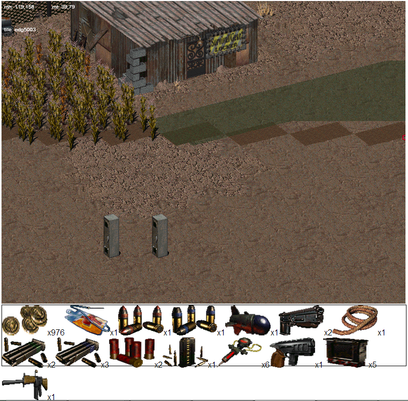
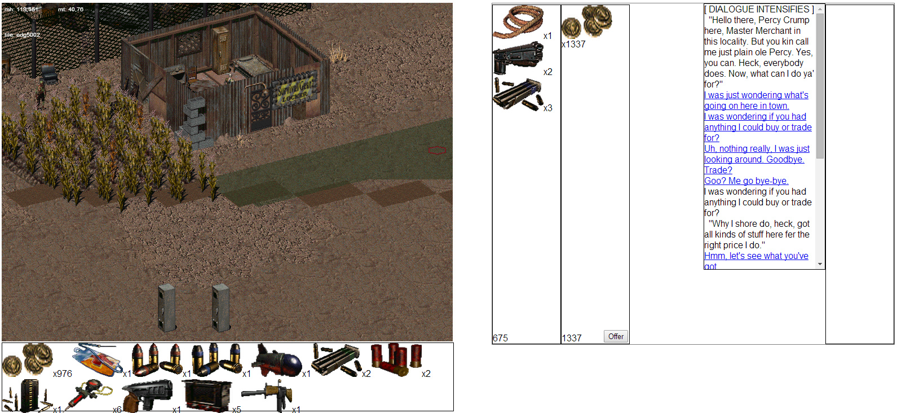

It's been quite a while since the last update -- over 2 weeks. A lot has been done, a lot learned, a lot lost (mostly just sanity), and it's been fun. Let's talk a little bit about what some of that was.

Animation
=========

This is one of my least favorite topics (surprise!), so let's cover this first.

One of the first major things I did since the last post was implement A* pathfinding over the hex grid.  This lets the player and NPCs find their way around the world, giving them an unblocked path to walk on, avoiding obstacles if necessary.
This was, all told, fairly simple. I had a mental block because non-square pathfinding gives me the creeps, but fortunately my friend helped me out with getting the position of hex neighbors, so that I could modify [PathFinding.js](https://github.com/qiao/PathFinding.js/) to work with the hex grid.

Next you need to be able to actually, you know, *walk* -- so in came animating frames. For walking, it worked out fine! But then I ran into an issue with running -- running went 3 hexes instead of 2, like walking did.
After I hacked up a solution that worked with both of those, I tried it with other models (like   ghouls, for instance) and it broke. Ghouls used 11 frames to walk 2 steps, vs 4 to walk 1 step and 8 to walk 2 steps, for `JMPS` (the Vault 13 jumpsuit model used by the player for the first portion of the game).

It turns out, animation in *Fallout 2* is more complex than I had thought even previously: animations are also broken into sub-animations, which old FIFE called *partial animations*. For example, the walking animation for `JMPS` would advance 4 frames for the first step, and if it needed to go any further than that, advance the other 4 frames to the next partial. FIFE calculates these partials based on the total movement distance. The problem I have is *when* to play these animations -- if I am at the end of partial #2 for walking, for instance, what do I do now? Do I repeat partial #2 or go to partial #1? My experiments left me empty-handed for now.

Animation will likely be one of the last major things I tackle in this project, since it doesn't interest me a whole ton and it's not imperative until the point of polishing, essentially. Static animations play fine, even though movement animations such as walking or running are choppy and skip in the middle.

Objects
=======

Objects got some pretty big improvements. `.PRO` (Prototype) files are loaded in for each object now, which gains us information about them. Each object in *Fallout 2* has a corresponding prototype, referenced by a *Prototype ID* (*PID*; although *PID* is seemingly ambiguously used to refer to both the prototype number and the object type, which make up 4-byte identifiers `0xTT00PPPP` -- T is a type, P is the index.) 

For instance, for critters, the information given includes: stats, damage resistances, age, gender (surprisingly, a 4-byte integer for only the set {0, 1}), skills, the type of damage they deal (for NPCs), etc.

For items: attack mode (interestingly, this is only used for weapons, even though this field is common to all items and despite there being sub-type specific fields), item sub-type (weapon, ammo, drug, ...), weight (you have a limited carry capacity), cost (... and money), and a *PID* for the art when it is displayed as an inventory item.

There are a few sub-types: weapons contain what you'd expect (some information for the model to use, min/max damage, damage type (plasma, electrical, normal, ...), projectile PID (probably only for some guns, like the plasma rifle), minimum Strength stat to wield, PID of the ammo type it uses, the maximum ammo and magazine/clip/etc capacity.
Armor contains stats for blocking damage (DR/DT), drugs contain information on stats affected, duration of their effects, etc. Very useful stuff.

Inventory item count is also parsed -- so you may have 100 copies of the same gun in your inventory (should you be able to carry that much.)

Objects can also have a script associated with them. Common script types include critter scripts (they usually handle dialogue, bartering and hostilities; or, for peasants, wandering and speaking random messages), scenery (doors and locked containers), miscellaneous items (animated monitors and such use `ANIMFRVR` which does as you'd expect.)

Scripting
=========

And so comes the meat of the article. Scripting, my favorite piece of the DarkFO puzzle.

Scripting causes me quite a bit of grief in this engine. It uses a weird, weakly typed, not well-defined Pascal/Oberon-inspired language -- which by the way is *case-insensitive*, so I need to knock all identifiers down to lowercase -- and the engine commands are not very well documented. The official map editor ships with *COMMANDS.DOC*, but it is either lacking, confusing, or just plain blatantly wrong. Likely half of commands (quite a few that I've seen) are undocumented entirely, some are mistyped, some have the wrong parameters (or perhaps they accept multiple types of arguments?)... it's, quite frankly, a mess. And I think the developers knew it.

So, after fixing some bugs in the transpiler (such as not writing grouping for operator precedence correctly), some more things started to work. I implemented *LVAR*s (which default to zero because that's what they do!), as well as stubbed some stat-related functions, and now NPC reactions work. *Fallout 2* includes a reaction system for a lot of NPCs with dialogue. It's simple: the more they like the actions you've done (populace of particular factions killed, your stance on slavery, how many children you've killed, etc.) and the more Charisma you have than them, the more they like you. Their disposition will be higher toward you, which can result in more friendly messages, special quests (like gaining party members!), or even a discount on bartering goods.

The next (and more recent) challenge was dealing with items and inventory related functionality. Scripts can, of course, check if items (referenced by their PID index -- I imagine, with the lack of type, these only refer to item types) are in an object's inventory, add items there, remove them, etc. Scripts can spawn arbitrary items (by PID index again(? What about non-item types? Maybe it accepts both, treating it as a full PID if the most significant bytes are non-zero?), and even attach an arbitrary script).

Of course UI was added to view object inventory, which shows their icons and relevant information (name and amount of them in the stack).

So, with this all implemented, what can we do now? Well... we can implement bartering!

And so I did. I chose to test this with Percy in Gecko's Junkyard. Wooz (in the Gecko Settlement) only sells booze, and not through the standard barter system, but through adding the booze directly in a script, and removing money.)

So, my first step was to get Percy's script running. Of course, I quickly ran into stuff *not existing*. For one thing, Percy uses *two containers* (footlockers outside of the map's scrolling bounds) -- one as a temporary box to store his personal inventory, and one to permanently store his store contents. These are object pointers that are imported (`import variable` FTW...) from the map script. Of course, the map script merely acts like a global container for these singletons (`export variable` FTW...), the actual scripts that set these container variables are `GIPERBOX` (for Percy's box) and `GIJNKBOX` (for the generic Gecko Junkyard box.)
These scripts are meant to be attached to a container item in the map editor, which then signifies *that container* as Percy's or the Junkyard's box. (This is just `import variable whichever_box; procedure map_enter_p_proc whichever_box := self_obj; end`).

An Aside
========

The problem was, I didn't see these scripts loaded in DarkFO. So I re-ran my map loader, figuring the map was just old. Nope, still not there... Where are they? I looked in the unofficial Mapper, neither seemed to be there, on those footlockers. What?

I scrambled looking over the modding wiki for documentation, for prototypes and maps. Indeed, it appeared correct -- so where was it getting `GIPERBOX` from? It *had* to load that (and `GIJNKBOX`, further) to work.

Well, there was one section I gloss over: [Map Scripts](http://falloutmods.wikia.com/wiki/MAP_File_Format#MAP_Scripts). This incredibly confusing and undocumented section of maps contains some weird table of scripts (I *don't know why*! I just realized that it could be due to them importing map variables, so maybe they are `extern` linked or something.)

Well, I hackily hacked together a hacky way to note those map scripts as well, and if the map script ID is there but the regular script ID isn't, use that table. Now we have `GIPERBOX` loading.

...Wait, what was that? No `GIJNKBOX`? No indeed. I double-checked my hacks, the script IDs... that left footlocker just *did not* have a script attached! How was this?

Now, I use the vanilla scripts released with Mapper, which are pre-1.02 patched, so I load the map in Mapper. Mapper has a feature to list all of the scripts used in the map by highlighting their name over the object. I clicked the menu item... and `GIPERBOX` displayed. Not `GIJNKBOX`. What? It has to load those from *somewhere* to work.

So I re-load my 1.02-patched maps, and reload them. Nope, not there. *What kind of magic is this?* At least the unofficial Mapper shows `GIPERBOX` now (it now uses a script ID instead of a map script ID, I believe. Huh.)

Well, I got to thinking. Maybe I am just crazy. No, maybe I am just overthinking it... I read Percy's script again.

    procedure talk_p_proc begin
       // ...
       move_inven_to_temp_box
       move_inven_from_box
       
       // ...
       move_inven_to_box
       move_inven_from_temp_box
    end

Where `move_inven_{to,from}_temp_box` are defined as:

    #define move_inven_to_temp_box         move_obj_inven_to_obj(self_obj, gecko_junkyard_temp_box);
    #define move_inven_from_temp_box       move_obj_inven_to_obj(gecko_junkyard_temp_box, self_obj);

Well, let's assume that the script `GIJNKBOX` wasn't loaded. The `gecko_junkyard_temp_box` pointer would be NULL (zero).
 
Well, if those functions were to fail silently on a NULL object pointer, and they did nothing, then Percy's personal inventory would not be transferred out to the temporary box, and would intermingle with his store goods.
I load up the game to check this. And... facepalm! Yep, he doesn't start with anything for a personal inventory. If you pickpocket some items onto him, and *then* barter with him, his personal inventory will still be there for bartering.

This is a bug in *Fallout 2*. It should *not* even be a bug! Even if the mappers forgot to attach the `GIJNKBOX` script to a container, `move_obj_inven_to_obj` should not *silently fail* on a NULL object pointer! If it had errored and alerted the scripters to this problem, this bug would not exist. *Sigh*.

Back to Bartering
=================

So, today I implemented bartering. I implemented a dead simple temporary UI mostly mimicing the *Fallout 2* one: two panes for merchant/player inventory, and two more panes for the merchant/player bartering area. (This kind of imitates a wood table that you're bartering for goods on.)

Additionally you can, like *Fallout 2*, only barter specific amounts on items. So if you only want to give the merchant 200 coins, go for it. It will prompt you.

After you're done swapping items between sides of the table, you can make an offer.
A successful offer is one where you offer equal to or more than the value you requested from the merchant. So, if you want their gun that's worth $500, better lay down some items of your own that cost a total of at least $500. ("Money", which are worth $1 each, usefully. They're also [gold-minted](http://fallout.wikia.com/wiki/$1_NCR). Mmm, minty.)

Scripting, Pt II
================

There's a problem, though: this doesn't work with entirely vanilla scripts. I don't have `import variable` implemented for referencing variables from map scripts, so I manually edit that in. That's not the problem, though (that would be trivial to implement).

The problem is the part:

       // ...
       move_inven_to_box
       move_inven_from_temp_box

The `// ...` is actually where the dialogue calls take place. Things in their call tree like `Reply` and `NOption`... Dialogue sessions which the script expects to block on. As evidenced by moving the inventory back into their proper boxes after calling all of the dialogue functions.

This is a problem, because our scripts are just interpreted JavaScript -- we cannot really control the execution. We use asynchronous APIs for the dialogue UI. We cannot busy-wait: that would be terrible and most JS engines are single-threaded. JavaScript does not have first-class support for suspending computations.

This is a problem in our scripting engine. I can think of two decent, viable solutions:

- JavaScript 1.7 Generators to suspend computation while the dialogue interface is run
- Compiling the scripts to a virtual machine bytecode and interpreting that in JS, suspending execution when necessary

The reason I didn't go ahead and implement the first options is that generators are currently (Really? It's 2014, where are my generators?) only supported by Firefox and Chrome -- and the latter requires some "Enable Experimental JavaScript" (doesn't that sound scary?) flag enabled to be used. This isn't really acceptable, because I want to target a wider variety of platforms (such as various WebKit browsers that may not use experimental V8 or SpiderMonkey features.)

The second option is more reasonable but I'd have to spend ~200 lines on implementing a simple stack VM that  kind of offers less information about the script, and isn't human-readable and thus harder to debug. It would, however, support anything reasonably possible with the scripting language. The *Fallout 2* engine itself uses a VM.

This still remains for debate. For now I will just patch scripts if I need to test bartering.

Conclusion
==========

As expected, this is a fun project. A fun *long-term* project, even. It's *extremely* unusual that I stick with a project for this long, and it's a very welcome change. I hope I continue seeing it through to its end.

There are still have quite a few large chunks to work on -- combat (rough draft of the turn system exists, but *rough* is an understatement) and AI, skills, perks/traits, the party system, moving between maps (exit grids, ladders, elevators, scripts...), saving/loading, and animation.

Quite a lot has already been implemented, as well. It's come a long way since the first steps. It's fun watching the project grow and grow.

And at least we don't have to deal with *Unity*.

Until next time.
