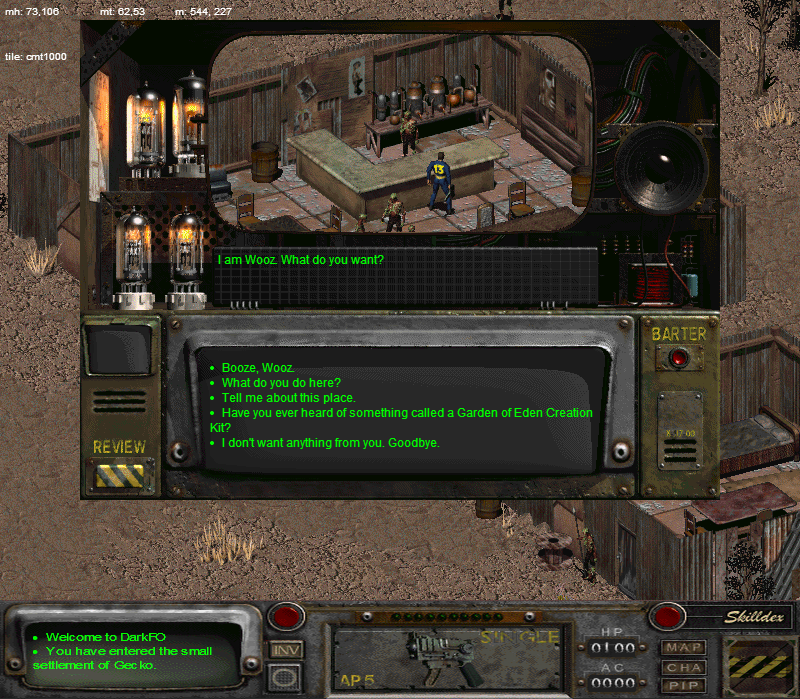
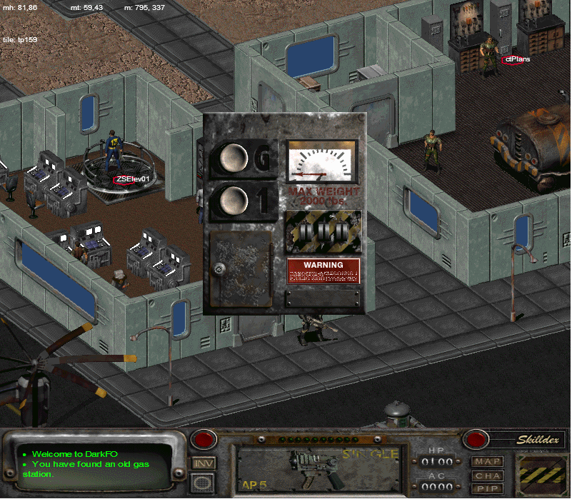

Wow, it's been a while, hasn't it? A lot of work has been done on DarkFO in the past weeks, major and minor both. Let's review them.

Gameplay
========

Stats and Skills have been more properly implemented. They're both bounded. There are dependent stats like `Critical Chance` whose formulas depend on other stats.

You can now click through the transparent parts of objects. This means that clicking in the open part of a door or some other object no longer uses *that* object, but the one below it that you actually clicked on.

Z-sorting is also now implemented, meaning when objects move, they are drawn in the correct order. Before, they would just draw over half of the other objects, even when they're behind them. The caveat to this is that walking animations are not really perfect -- moving/Z-sorting will only happen every partial animation. This will have to be fixed in the future.

You can now move objects to your Item 1 / Item 2 slots (your hands), so you can equip weapons now, to use things like spears.

Using certain objects has been implemented. You can use containers (they will open and then let you loot them), and explosives (you can arm them for some specific time and they will explode, damaging things in a radius. The damaging part hasn't been implemented (it just hasn't!), but it *does* hook up to the scripting engine (this is *required* to beat the game -- you need to blow up the impenetrable door (how ominous!) in the *Temple of Trials* starting area with Plastic Explosives. You now can. It's also useful in the last areas of the game -- the *Oil Rig* -- where you can blow up a nuclear reactor control station. Not necessary, but cool.)

UI
==

This is a big one. Instead of the makeshift UI of yesterweeks, I just went ahead and tried retrofitting the original *Fallout 2* UI into HTML5/CSS3/JS. What a horror and a half that has been, but it does look pretty. See for yourself.

It's scaled up slightly to fit the current screen size, but it will likely be better scaled in the future. It's also highly moddable -- most of the UI elements' styles are controlled via CSS, or in the worst case, JS. It supports extending and reskinning.

The little "end turn/combat" button (as you see in the lower right with the yellow and black stripes) animation is done with CSS3 animations. Reasonable browsers have vendor prefixes for this as of the time of writing (around August 2014).

Dragging and dropping is done via the HTML5 Drag and Drop API. While probably not the best choice (especially for dragging between same-page elements), it is reasonable and allows it to be fairly fluid.

The world map is actually a huge hassle to implement because it's just a bunch of images stitched together that are composed of tiles covered in a fog of war with 3 states (undiscovered, bordering, and discovered. "Bordering" tiles are uncovered when you visit one of the adjacent neighbors, and are pretty much just grayed. Discovered tiles are entirely uncovered.)
In addition to that, you also have a presence in it. It's your main method of transportation between areas -- if you want to go from *Klamath* to *The Den*, you need to traverse the desert wasteland, possibly encountering (randomly, based on set conditions in a mini-language and an encounter rate) special and/or hostile encounters. That will be a major thing to be implemented in the future.

Smaller screens like dialogue (pictured above), inventory, bartering, looting, etc. are implemented as well.
This makes it look a lot more like a *game* -- heck, I even confuse it for the real game when I'm glancing at screenshots.

Still, some work is needed to smooth some rough edges. That will be in the future.

Scripting
=========

Not much *major* has gone on in the scripting language area. There are a bunch of random and miscellaneous improvements (like imported map variables being referenced correctly) that make a lot of things work better, but it's still using the same engine.

Scripts can do somewhat silly things, sometimes. Objects (like wells) sometimes have scripts that recursively add a timed event every tick (1/10 a second). *Hypothetically* if my timed event scheduler were to also evaluate events made during events, it would result in an infinite loop. Good thing that didn't happen! *Heh!*

There are also brahmin that act weird if they cannot figure out if they're inside their pen (say, if `tile_in_tile_rect` were not implemented...)
They would do things like walk into a wall repeatedly in a slaughterhouse and then run your pathfinding algorithm ten times a second. What a mess *that* would be!
It just really wants to be cheezburger.

Spatial Triggers
================

These are interesting.

Spatial triggers are scripts attached to a coordinate in space and a range such that when a critter walks within range, the script's `spatial_p_proc` procedure is called.

This is used for elevators (more on this next!), mines (notably in the entrance to *Navarro*), traps (*Temple of Trials*, etc), and certain script triggers.

These are wrapped up in the script section of maps, which is mostly undocumented. I reverse engineered the fields I needed via experimentation, but I later discovered a Russian document also makes these finds (why they're not mentioned in the map format documentation by the same team/website, I'm not sure. They're just labeled as unknown.)

Elevators
=========

Ahh, elevators. Such a simple concept. Well, the *Fallout* developers decided that wasn't good enough, so they made it complicated.

So, here's a rough outline of how the elevatoring process works in *Fallout*:

  - You have an object that is the visual part of the elevator. This does pretty much nothing but look pretty.
  - You have a spatial trigger attached to `ZSElev01` (`ZSElev02` is seemingly just a copy of it, don't worry about it.) which calls `elevator(-1)` (where `elevator` is a macro in this case de-sugaring to `metarule(15, -1)`.)
  - `elevator`/`metarule` then calls into the engine.
  - The engine searches around the spatial trigger in a 11x11 tile rectangle (if the Russian docs are to be trusted) for an invisible object with a specific PID called `Elevator Stub`.
  - The elevator *type* and *level* (as far as I know level is unused, it might not be) is taken from the stub.
  - The elevator type is used for a lookup table *hardcoded into the Fallout/Fallout 2 .exe itself*(!!!) to figure out the interface art / the button count / where the buttons go.
  - It pops up the interface and lets you hit buttons and they take you places.

Now, WTF? *Every elevator* in *Fallout* / *Fallout 2* is *hardcoded in the executable*. Sigh. Yes, this means that it's difficult for modders to add new elevators. They have a few choices in the matter:

  - Replace an existing elevator with information for their own (the replaced elevator can no longer be used.)
  - Imitate it with a script. (This means no elevator interface.)
  - Use Sfall (an engine tweaker/injector by a very clever person.) It lets you add in new elevators without overwriting old ones.

Clearly this was not the best way to implement elevators... Please, if your game has elevators, don't hardcode them!

Anyway, the result of parsing out this table and writing all of the necessary code to hook it up results in:

Beautiful.

Conclusion
==========

*Fallout 2* is a really complex game. It was *way* ahead of its time. There are a lot of complex and emergent behaviors inhabiting the game and its community. It's just unfortunate that they had to take a lot of shortcuts to get the game to run (and perform decently on the PCs of the time.) It's more complicated to emulate the game and its idiosyncrasies. In that way, and that way only, it's fitting that I'm using JS to implement most of it.

Hope you enjoy reading. Go play some *Fallout 2*.